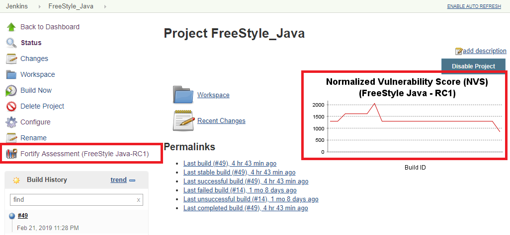
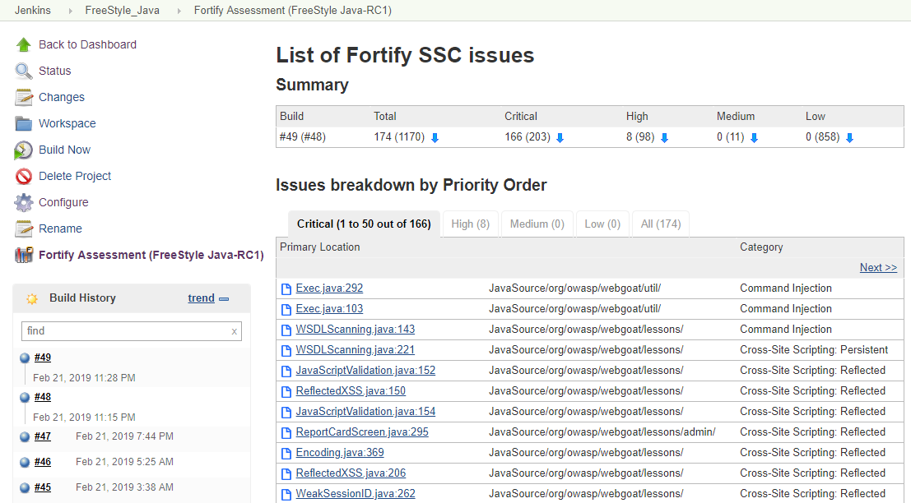
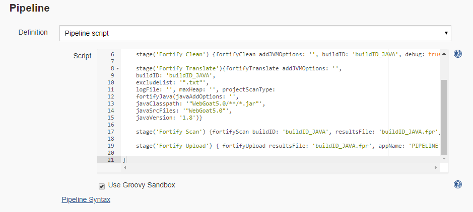

# Fortify Jenkins plugin

This is the official Jenkins plugin for Fortify Static Code Analyzer (SCA) and Fortify Software Security Center (SSC).

| Plugin Information                                                                          |
|---------------------------------------------------------------------------------------------|

The plugin adds the ability to perform security analysis with Micro Focus Fortify Static Code Analyzer, upload results to Micro Focus Fortify Software Security Center, show analysis results summary, and set build failure criteria based on analysis results.

### Summary

Use the Fortify Jenkins Plugin in your continuous integration builds to identify security issues in your source code with Fortify Static Code Analyzer. After the Fortify Static Code Analyzer analysis is complete, you can upload the results to a Fortify Software Security Center server. The Fortify Jenkins Plugin also enables you to view the analysis result details within Jenkins. It provides metrics for each build and an overview of the results, without requiring you to log into Fortify Software Security Center.

### Documentation

You can find official plugin documentation here: https://www.microfocus.com/documentation/fortify-jenkins-plugin/

For more information about Fortify SCA, visit https://www.microfocus.com/cyberres/application-security/static-code-analyzer.

For more information about Fortify SSC, visit https://www.microfocus.com/cyberres/application-security/software-security-center.

### Features

*   Provides a post-build action to analyze the source with Fortify Static Code Analyzer, update Security Content, to analyze remotely on Fortify ScanCentral using remote translation and scan, upload analysis results to Fortify Software Security Center, and fail the build depending on uploaded results processed by Fortify Software Security Center
*   Provides pipeline support for source code analysis with Fortify Static Code Analyzer, Security Content update, and uploading to Fortify Software Security Center
*   Displays Fortify security analysis results for each Job (a history trend and latest issues from Fortify Software Security Center), and navigates to individual issues on Fortify Software Security Center for detailed analysis

### Video tutorial

<http://youtube.com/watch?v=cjEwDmTsxII>

### Setup

This set of instructions describes how to configure the plugin to run a local Fortify Static Code Analyzer scan, upload the analysis results to Software Security Center, an then see the analysis results in Jenkins. You can also run the analysis with ScanCentral SAST. See the full documentation for instructions.

1.  Create an authentication token of type CIToken. 
        Log in to Fortify Software Security Center, click the Administration tab and select Users -\> Token Management on the left panel.
        Click New to create an authentication token of type CIToken, and then click Save.
        Copy the decoded token at the bottom of the dialog box.

2.  From Jenkins, select **Manage Jenkins \> Manage Plugins**, on the **Plugin Manager** page. Click the **Available** tab. In the **Filter** box, type Fortify. Select the check box for the **Fortify** plugin, and then click either **Install without restart** or **Download and install after restart**.

3.  From the Jenkins menu, select **Jenkins \> Manage Jenkins \> Configure System**. To use a fail condition and see analysis results in Jenkins, you need to upload the locally run analysis results to Fortify Software Security Center, so scroll down to the **Fortify Assessment** section, and then do the following:
    -   In the **SSC URL** box, type the Fortify Software Security Center server URL. The correct format for the Fortify Software Security Center URL is: http://\<*host\_IP*\>:\<*port*\>/ssc.
    -   In the **Authentication token** box, type the authentication token generated for the Fortify Software Security Center server in step 1.
    -   To connect to Fortify Software Security Center with a proxy server, select **Use proxy**, and then specify the proxy information. Use the following format for the **Proxy server host:port**: *\<address\>*:*\<port\_number\>*  
    -   Click **Test SSC connection**.

4.  To analyze your project with Fortify Static Code Analyzer or to update Fortify security content as part of your build, create a Jenkins environment variable to specify the location of the Fortify Static Code Analyzer executable. In **Global properties**, create the following environment variable:
    -   **Name:** FORTIFY\_HOME
    -   **Value:** *\<sca\_install\_dir\>*
where *\<sca\_install\_dir\>* is the path where Fortify Static Code Analyzer is installed. For example, on Windows the default installation location is C:\\Program
Files\\Fortify\\Fortify\_SCA\_and\_Apps\_*\<version\>*.

### Configuration when running Jenkins from Docker

When running Jenkins in a Docker container, mount *\<sca\_install\_dir\>* directory to the Docker container to make Fortify Static Code Analyzer executables
accessible from Docker. The following command is an example of how to do this:

    docker container run \
      -p 8080:8080 \
      -v /home/admin/Fortify/Fortify_SCA_and_Apps_21.2.0:/var/jenkins_home/Fortify/Fortify_SCA_and_Apps_21.2.0 \
      --name=jenkins \
      jenkins/jenkins -d

For this example, the value of FORTIFY\_HOME is `/var/Jenkins_home/Fortify/Fortify_SCA_and_Apps_21.2.0`.

### Preview

### Advisory

Older versions of this plugin might not be safe to use. Review the following warnings before using an earlier version:

-   [Credentials stored in plain text](https://jenkins.io/security/advisory/2020-01-29/#SECURITY-1565)

### Feedback welcome

This plugin is maintained by the Fortify team. If you have any problems, questions, or enhancement requests or would like to contribute to the code please let us know via GitHub Issues.

## License

[MIT License](./LICENSE)

## More information

* [Changelog](https://github.com/jenkinsci/fortify-plugin/releases)
* [Developer documentation](./docs/DEVELOPER.md)
